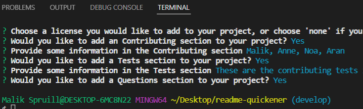

# README Quickener

## Description
This repo is centered around node, utilizing the command-line for prompts that will help generate a unique README.md file.  After doing several projects, developers often go tired consistenly framing README files whereas they will now be able to use an application like this one, providing more focus to their current projects.  

  

## Installation
- This project will requires the use of:
- node.js
- inquirer npm (for question prompts)
- fs npm (for writing the README files within a folder)

## Usage
Once everything is installed, open a cli tool (like git bash for windows or terminal for mac). Type `node ./src/index.js`, and the prompts should begin in the command line.  Once all prompts are answered, a README file should generate in the sub-directory folder named as `tmp`.  There you have it, a newly generated readme.

## Contributions
Malik Spruill
Xandromus
gchoi2u
